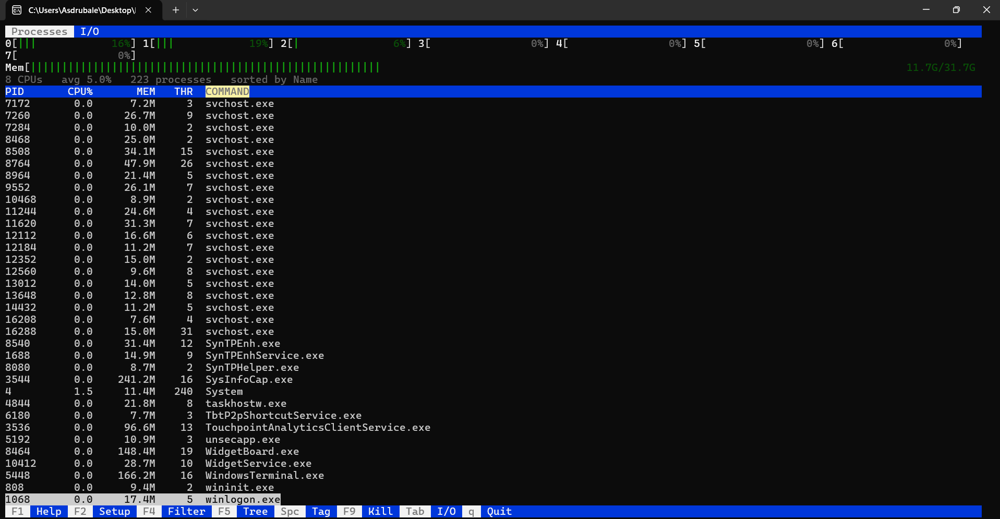
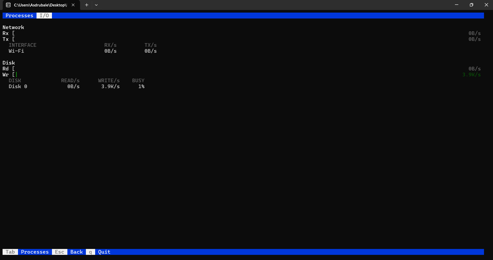

# wtop

[](https://github.com/lorenzo-cingano/wtop/releases/latest)

An htop-style process viewer for Windows, written in pure C using only the
Win32 API and the C standard library - no external dependencies.



## Build

Requires a C compiler (tested with GCC 16 from MSYS2 UCRT64).

```sh
make
```

Or directly:

```sh
gcc -O2 -Wall -Wextra -std=c11 src/*.c -o wtop.exe
```

## Install

To run `wtop` from any console, install it for the current user:

```sh
wtop --install
```

This copies the executable to `%APPDATA%\wtop\wtop.exe` and adds that directory
to your per-user `PATH` (no administrator rights required). Open a **new**
console afterwards and just type `wtop`. Installation refuses to proceed if a
copy is already present - run `wtop --uninstall` first to reinstall.

To remove it:

```sh
wtop --uninstall
```

This deletes the installed executable and removes the `PATH` entry, leaving the
rest of `PATH` untouched. Your settings file (`%APPDATA%\wtop\wtoprc`) is kept.
When you uninstall the copy you launched from `PATH`, the running executable
cannot delete itself, so its removal is deferred until just after it exits.

| Option | Action |
|--------|--------|
| `--install` | Copy into `%APPDATA%\wtop` and add it to `PATH` |
| `--uninstall` | Remove the installed copy and the `PATH` entry |
| `-h`, `--help` | Show usage |

## Run

```sh
./wtop.exe
```

The display refreshes every 1.5 seconds.

### Keys

| Key | Action |
|-----|--------|
| `↑` / `↓` or `k` / `j` | Move selection up / down |
| `PgUp` / `PgDn` | Page up / down |
| `Home` / `End` or `g` / `G` | Jump to first / last process |
| `<` / `>` | Cycle the sort column left / right |
| `Space` | Tag / untag the selected process |
| `F1` or `?` | Show the help overlay |
| `F2` | Open the setup / configuration screen |
| `F4` or `/` | Filter the process list by name |
| `F5` or `t` | Toggle tree view (parent/child hierarchy) |
| `Tab` or `F6` | Switch between the process list and the I/O tab |
| `F9` | Kill the selected process, or every tagged process (asks `y/N` first) |
| `q` / `Esc` | Quit |

### Mouse

The interface is fully clickable. Console mouse input works on the classic
Windows console host as well as Windows Terminal, and the keyboard keeps working
exactly as before.

- Click a process row to select it.
- Click a column header (`PID`, `CPU%`, `MEM`, `THR`, `COMMAND`) to sort by it;
  click the active column again to reverse the order.
- Scroll the wheel to move up and down the list.
- Click the tabs at the top (`Processes` / `I/O`) to switch screens.
- Click any button in the bottom key bar to trigger it.

### Tagging (`Space`)

`Space` tags (or untags) the selected process and advances to the next row, so
you can mark several quickly. Tagged processes are highlighted and counted in the
summary line, and the tags follow each process by PID across refreshes. While one
or more processes are tagged, `F9` terminates the whole tagged set after a single
`y/N` confirmation instead of just the selected process.

### Filtering (`F4` / `/`)

Type a substring to narrow the list to processes whose name matches
(case-insensitive); the table updates as you type and you can navigate the
filtered set live. `Enter` applies the filter and returns to navigation; `Esc`
clears it. While a filter is active the summary line shows `matched/total`.

### Tree view (`F5` / `t`)

Toggles between a flat sorted list and a parent/child tree built from each
process's parent PID. Children are indented under their parent with connector
glyphs (`├─`, `└─`, `│`) and sorted by the active sort key within each parent.
When a filter is active in tree mode, matching processes are shown together with
their ancestors so the path to each match stays visible. The summary line shows
`[tree]` while it's on, and the setting persists across runs.

### I/O tab (`Tab` / `F6`)

Switches to a full-screen view of system throughput, and `Tab`/`Esc` returns to
the process list.



It shows:

- **Network** - aggregate receive (`Rx`) and transmit (`Tx`) meters, plus a
  per-interface breakdown of `RX/s` and `TX/s`. Loopback, down, and NDIS filter
  pseudo-interfaces are excluded so traffic isn't double-counted.
- **Disk** - aggregate read (`Rd`) and write (`Wr`) meters, plus a per-physical-
  drive breakdown of `READ/s`, `WRITE/s`, and a `BUSY` percentage.

Rates are computed from the byte-counter delta over the real elapsed time, so
they stay accurate at any refresh interval. The meters auto-scale against a
decaying recent peak (with a sensible floor) so both quiet and busy periods read
clearly. Network counters come from `GetIfTable2`; disk counters from
`IOCTL_DISK_PERFORMANCE` on each `\\.\PhysicalDriveN` - both work without
administrator rights.

### Setup screen (`F2`)

`Up`/`Down` (or `j`/`k`) select an option, `Left`/`Right` (or `h`/`l`, or
`Enter`) change it, `F2`/`Esc` returns to the process list. Configurable:

- **Refresh interval** - how often wtop samples (250 ms … 10 s).
- **Sort by** - CPU%, Memory, PID, Threads, or Name.
- **Sort order** - descending or ascending.
- **Per-core CPU meters** - per-CPU grid, or a single combined meter.
- **Tree view** - parent/child tree, or a flat sorted list.

Settings are saved to `%APPDATA%\wtop\wtoprc` on exit and reloaded at startup.

## What's implemented

- **Per-core CPU meters** - one colored bar per logical CPU, tiled into a grid
  that adapts to the window width (via `NtQuerySystemInformation`).
- **Memory meter** - physical RAM usage as an htop-style colored bar.
- **Process table** - PID, CPU%, working-set memory, thread count, and command
  name, sorted by CPU usage.
- **Keyboard navigation** - scrollable, selectable process list; the selection
  follows its process by PID across refreshes.
- **Kill** - `F9` terminates the selected process after a `y/N` confirmation
  (`TerminateProcess`; the outcome is reported in a transient status line).
- **Configuration** - `F2` opens a setup screen for refresh rate, sort column
  and direction, and meter style; the active sort column is highlighted in the
  table header. Settings persist to `%APPDATA%\wtop\wtoprc`.
- **Filter** - `F4` (or `/`) filters the list by a case-insensitive name
  substring, updating live as you type.
- **Tree view** - `F5` (or `t`) shows processes as a parent/child hierarchy
  with connector glyphs; children are sorted under each parent.
- **I/O tab** - `Tab` (or `F6`) switches to a network + disk throughput view
  with auto-scaling Rx/Tx and read/write meters and per-interface / per-disk
  breakdowns.
- **Mouse support** - click rows to select, column headers to sort, the top tabs
  to switch screens, and key-bar buttons to act; the wheel scrolls the list.
  Driven by `ReadConsoleInput`, so it works on the classic console host too.
- **Tagging and bulk kill** - `Space` tags processes (tracked by PID across
  refreshes) and `F9` then terminates the whole tagged set at once.
- **Help overlay** - `F1` (or `?`) lists every key binding over the current view.
- **Rendering** - alternate screen buffer with VT escape sequences, double-
  buffered per frame to avoid flicker.
- **Self-install** - `--install` / `--uninstall` copy wtop into `%APPDATA%` and
  add/remove it on the per-user `PATH` (no admin rights needed).

## Architecture

The TUI is split into a console output layer, an input layer, reusable widgets,
a UI core that runs the loop, and one module per screen. Each screen exposes a
render function and an event handler behind a small dispatch table, so screens
are independent and `main.c` stays thin.

| File          | Responsibility                                          |
|---------------|---------------------------------------------------------|
| `terminal.c`  | Console/VT output setup, alternate screen, frame buffering |
| `input.c`     | Keyboard + mouse + resize events via `ReadConsoleInput`, normalized |
| `widgets.c`   | Shared meters, key bar, tab bar, layout, and click hitboxes |
| `ui.c`        | Run loop, view dispatch, help overlay, status line, shared state |
| `view_proc.c` | Process screen: meters, table, filter, tree, tagging, kill |
| `view_io.c`   | I/O screen: network + disk throughput                   |
| `view_setup.c`| Setup / configuration screen                            |
| `sysinfo.c`   | Overall + per-core CPU and memory stats                 |
| `proclist.c`  | Process enumeration (one syscall), CPU%, sort + filter + tree |
| `iostat.c`    | Network (`GetIfTable2`) + disk (`IOCTL_DISK_PERFORMANCE`) rates |
| `config.c`    | Load/save settings to `%APPDATA%\wtop\wtoprc`           |
| `install.c`   | `--install` / `--uninstall`: copy to `%APPDATA%` + PATH  |
| `main.c`      | CLI args, startup/teardown, hands off to the UI loop     |

## Notes & limitations

- CPU% is expressed per single core (a fully-busy core reads 100%), matching
  htop conventions; a process can exceed 100% on multiple cores.
- The process list comes from a single `NtQuerySystemInformation` call rather
  than opening a handle per process, so a refresh is cheap (~0.2% of one core
  at 1.5 s) and protected processes still appear with full stats.
- Per-core meters cover one processor group (up to 64 logical CPUs).
- Killing a protected/elevated process can fail with "access denied"; run from
  an elevated console to terminate those.
- Tree view links processes by parent PID; if a parent has already exited and
  its PID was reused, a child may attach to the wrong parent (a limitation
  shared with other process viewers).

## License

© 2026 Cingano Development. Released under the BSD Zero-Clause License (0BSD) -
the most permissive license, imposing no conditions on use. See [LICENSE](LICENSE).
